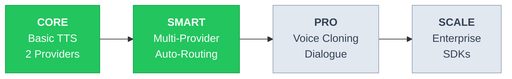
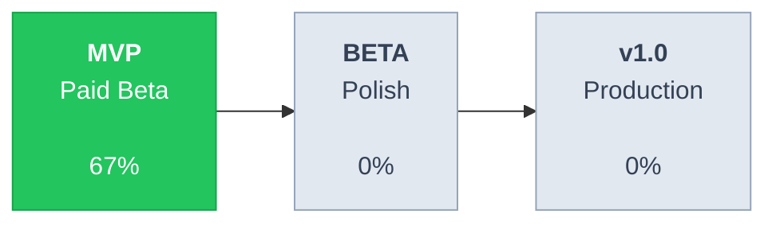

# VoiceProcessor Roadmap

Last updated: January 22, 2026

---

## Product Roadmap



| Phase | Name | What You Get | Status |
|-------|------|--------------|--------|
| **1** | **Core** | Text-to-speech with ElevenLabs & OpenAI, long-form support | **Available** |
| **2** | **Smart** | 6+ providers, smart routing (cost/quality/speed), pay-as-you-go | **In Progress** |
| **3** | **Pro** | Voice cloning, multi-speaker dialogue, pronunciation control | Planned |
| **4** | **Scale** | Enterprise API, mobile SDKs, webhook integrations, white-label | Future |

---

## What is VoiceProcessor?

VoiceProcessor is a **multi-provider Text-to-Speech platform** that lets you convert text to natural-sounding audio using the best AI voices from ElevenLabs, OpenAI, Google, Amazon, and more — all through one simple API.

### The Problem We Solve

| Problem | Impact |
|---------|--------|
| Converting a book to audiobook costs **$5,000-$15,000** with traditional services | Indie authors can't afford professional audiobooks |
| Existing TTS platforms lock you into **one provider** with prepaid credits that expire | Wasted money, limited voice options |
| No easy way to **compare quality/cost** across providers | Users overpay or get poor quality |
| Long content requires **manual chunking** and audio stitching | Hours of tedious work |

### Our Solution

- **Pay-as-you-go pricing** — No subscriptions, no expiring credits. Pay only for what you generate.
- **Smart routing** — Automatically pick the best provider based on your preference: cost, quality, or speed.
- **One unified API** — Access all major TTS providers without managing multiple accounts and API keys.
- **Long-form support** — Automatically chunk books/articles and merge into seamless audio.

---

## Who Is This For?

| User | Use Case | Value |
|------|----------|-------|
| **Indie Authors** | Convert books to audiobooks | $25-79 instead of $5,000+ |
| **Content Creators** | YouTube voiceovers, podcasts, courses | Fast turnaround, consistent quality |
| **Developers** | Add voice to apps via REST API | Simple integration, multiple providers |
| **Businesses** | Scale voice content production | No per-seat licensing, predictable costs |

---

## Feature Roadmap

### Available Now

- 100+ AI voices across multiple providers
- ElevenLabs & OpenAI TTS integration
- Smart routing (optimize for cost, quality, or speed)
- Long-form content support (books, articles, scripts)
- Intelligent text chunking with seamless audio merging
- REST API with key-based authentication
- OAuth login (Google, GitHub)
- Voice catalog with filters (language, gender, provider)
- Generation history and management

### Coming Soon (MVP)

- Stripe payments & credit system
- Voice preview before generating
- Audio download functionality
- Real-time generation progress
- User feedback & ratings

### Coming Later (Beta)

- Google Cloud TTS provider (budget-friendly option)
- Amazon Polly provider (AWS integration)
- Advanced analytics dashboard
- Webhook notifications

### Future Vision

| Feature | Description |
|---------|-------------|
| **Voice Cloning** | Upload a voice sample to create a custom voice |
| **Multi-speaker Dialogue** | Auto-detect characters in scripts, assign different voices |
| **Translation + TTS** | Translate text and generate speech in one step |
| **Pronunciation Dictionary** | Define custom pronunciations for names, brands, technical terms |
| **Video Dubbing** | Sync generated audio to video timestamps |
| **Mobile SDKs** | Native iOS and Android libraries |

---

## Pricing

| Provider | Cost per 1K chars | Quality | Best For |
|----------|-------------------|---------|----------|
| Google Cloud TTS | $0.004 - $0.016 | Good | Budget projects, high volume |
| Amazon Polly | $0.004 - $0.016 | Good | AWS ecosystem integration |
| OpenAI TTS | $0.015 - $0.030 | Great | Balanced quality and cost |
| Fish Audio | $0.015 | Great | Alternative voices |
| Cartesia | $0.010 | Great | High quality, competitive price |
| ElevenLabs | $0.18 - $0.30 | Premium | Maximum quality, emotional range |

**Example: Converting a 80,000-word novel (~400K characters)**

| Routing Preference | Provider Selected | Estimated Cost |
|--------------------|-------------------|----------------|
| Cheapest | Google Cloud TTS | ~$1.60 - $6.40 |
| Balanced | OpenAI TTS | ~$6 - $12 |
| Best Quality | ElevenLabs | ~$72 - $120 |

*No subscriptions. No expiring credits. Pay only for what you use.*

---

## Development Progress



**Current Phase: MVP (Paid Beta)** — 18/27 tasks complete (67%)

| Milestone | Target | API | Frontend | Focus |
|-----------|--------|-----|----------|-------|
| **MVP** | Feb 2026 | 8/13 (62%) | 10/14 (71%) | Core TTS + Payments |
| **Beta** | Mar 2026 | 0/6 (0%) | 0/6 (0%) | Monitoring + UX Polish |
| **v1.0** | Apr 2026 | 0/6 (0%) | 0/5 (0%) | Testing + Launch |

---

## Technical Stack

| Component | Technology |
|-----------|------------|
| **Backend API** | ASP.NET Core 10 / C# 14 |
| **Frontend** | Next.js 16 + React 19 + TanStack Query |
| **Database** | PostgreSQL 16 |
| **Cache & Jobs** | Redis + Hangfire |
| **Real-time** | SignalR |
| **Hosting** | Railway (API) + Cloudflare Pages (Web) |

### Architecture

```
+-------------------------------------------------------------+
|                    voiceprocessor-web                       |
|          Next.js 16 + React 19 + TanStack Query            |
+-------------------------------------------------------------+
                              |
                              v REST API + SignalR
+-------------------------------------------------------------+
|                    voiceprocessor-api                       |
|                  ASP.NET Core 10 / C# 14                    |
|  +---------+ +---------+ +---------+ +---------------------+
|  | Managers|>| Engines |>|Accessors|>| PostgreSQL + Redis  |
|  +---------+ +---------+ +---------+ | Hangfire, SignalR   |
+--------------------------------------+---------------------+
                              |
                              v Provider APIs
         +--------------+--------------+--------------+
         |  ElevenLabs  |   OpenAI     |  Google TTS  |
         |    (done)    |   (done)     |  (planned)   |
         +--------------+--------------+--------------+
```

---

## Development Milestones

<details>
<summary><b>Milestone 1: MVP (Paid Beta)</b> — Click to expand</summary>

**Goal:** End-to-end TTS generation with payment processing  
**Target:** Ready for early adopters

### Backend (API)

| Task | Status | Issue ID | Notes |
|------|--------|----------|-------|
| JWT Authentication | Done | - | JwtEngine, token generation |
| API Key Authentication | Done | - | X-API-Key header support |
| OAuth (Google/GitHub) | Done | - | GoogleOAuthEngine, GitHubOAuthEngine |
| Voice Management | Done | - | VoiceAccessor, auto-seeding |
| TTS Generation Workflow | Done | - | ChunkingEngine, RoutingEngine, PricingEngine |
| ElevenLabs Provider | Done | - | ElevenLabsAccessor |
| OpenAI TTS Provider | Done | - | OpenAiTtsAccessor |
| Background Processing | Done | - | Hangfire + GenerationProcessor |
| Stripe Integration | Planned | `9n7` | Payments, subscriptions, webhooks |
| Credits Deduction | Planned | `5b9` | Deduct on generation completion |
| FeedbackAccessor | Planned | `1mm` | Store generation ratings |
| API Rate Limiting | Planned | `z3f` | Prevent abuse |
| Railway Deployment | Planned | `nrc` | Production hosting |

### Frontend (Web)

| Task | Status | Issue ID | Notes |
|------|--------|----------|-------|
| Home/Landing Page | Done | - | Features, pricing preview, CTA |
| Login Page | Done | - | Email/password + OAuth buttons |
| Signup Page | Done | - | Registration with validation |
| Dashboard | Done | - | Stats cards, recent generations |
| TTS Generator | Done | - | Text input, voice selector, cost estimate |
| Generations List | Done | - | Filters, pagination |
| Voice Catalog | Done | - | Provider/language/gender filters |
| Settings UI | Done | - | Profile, API Keys, Billing, Connections |
| Generation Detail Page | Planned | `9dj` | Audio player, metadata |
| Profile API Integration | Planned | `ymc` | Connect form to API |
| Voice Preview Playback | Planned | `9t1` | Play voice samples |
| Pricing Page | Planned | - | Dedicated pricing page |
| Stripe Checkout | Planned | - | Payment flow integration |
| Cloudflare Deployment | Planned | `xze` | Production hosting |

</details>

<details>
<summary><b>Milestone 2: Beta Polish</b> — Click to expand</summary>

**Goal:** Production stability, monitoring, improved UX  
**Target:** Public beta launch

### Backend (API)

| Task | Status | Issue ID | Notes |
|------|--------|----------|-------|
| SignalR Real-time Progress | Planned | `bss` | WebSocket updates |
| Sentry Error Tracking | Planned | `tkn` | APM + error monitoring |
| PostHog Analytics | Planned | `ai5` | Feature flags, usage analytics |
| User Profile Endpoints | Planned | `8qr` | Update name, email, password |
| Google Cloud TTS Provider | Planned | - | Cost-effective option |
| Amazon Polly Provider | Planned | - | AWS integration |

### Frontend (Web)

| Task | Status | Issue ID | Notes |
|------|--------|----------|-------|
| Real-time Progress | Planned | `04s` | SignalR integration |
| OAuth Connections | Planned | `9hi` | Link/unlink Google/GitHub |
| Forgot Password Flow | Planned | `27x` | Email reset flow |
| Billing Page | Planned | `o7x` | Usage, invoices, plan management |
| Token Auto-Refresh | Planned | - | Proactive refresh before expiry |
| Download Audio | Planned | - | Download generated files |

</details>

<details>
<summary><b>Milestone 3: v1.0 Production</b> — Click to expand</summary>

**Goal:** Feature-complete, tested, scalable  
**Target:** Public launch

### Backend (API)

| Task | Status | Issue ID | Notes |
|------|--------|----------|-------|
| Unit Tests | Planned | `buu` | Engine + Manager coverage |
| Integration Tests | Planned | `buu` | API endpoint tests |
| Fish Audio Provider | Planned | - | Alternative provider |
| Cartesia Provider | Planned | - | High-quality provider |
| Subscription Tiers | Planned | - | Usage limits per tier |
| Webhook Events | Planned | - | Generation completed, etc. |

### Frontend (Web)

| Task | Status | Issue ID | Notes |
|------|--------|----------|-------|
| E2E Tests | Planned | - | Playwright test suite |
| Mobile Responsive Polish | Planned | - | All breakpoints |
| Error Handling UX | Planned | - | Graceful error states |
| Performance Optimization | Planned | - | Bundle size, lazy loading |
| Accessibility Audit | Planned | - | WCAG compliance |

</details>

---

## Contributing

1. Check available work: `bd ready`
2. Claim an issue: `bd update <id> --status in_progress`
3. Complete work: `bd close <id>`
4. Sync changes: `bd sync`

---

## Links

- **API Repository:** voiceprocessor-api
- **Frontend Repository:** voiceprocessor-web
- **Documentation:** Coming soon
